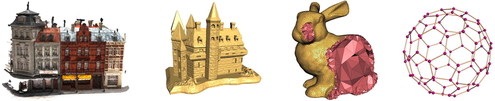
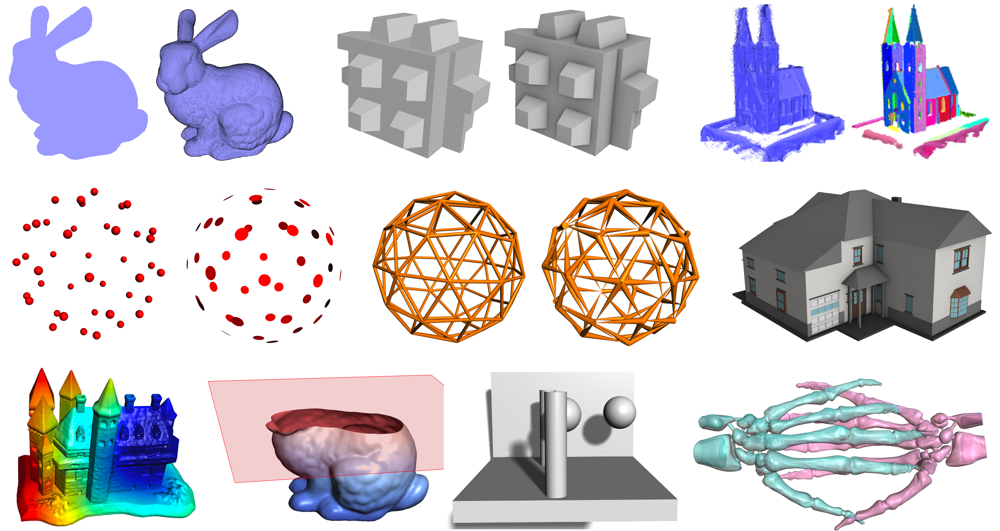

# Summary

*Easy3D* is an open-source library for 3D modeling, geometry processing, and rendering. It is implemented in C++ and designed with an emphasis on simplicity (i.e., processing and visualizing 3D data can be achieved by few lines of API calls). The contributions of *Easy3D* are threefold: (1) efficient data structures for representing common 3D data (i.e., point clouds, surface meshes, polyhedral meshes, and graphs), (2) commonly used algorithms for processing 3D data, and (3) standard techniques for the visualization of 3D data. The data structures, geometry processing algorithms, and rendering techniques can be seamlessly and easily integrated for the fast development of research prototypes or 3D applications. \autoref{fig:datastructures} and \autoref{fig:rendering} show overviews of the data structures and rendering functionalities respectively provided by *Easy3D*. 

# Statement of need

The amount of 3D data has been explosively increasing in the past decades, driven by the fast development of data acquisition techniques (e.g., laser scanning, photogrammetry, and 3D computer vision) and real-world applications (e.g., urban planning, autonomous driving, surveying, and entertainment). The processing and application of such data require specialized algorithms and software systems, for which great tools and algorithm libraries have been developed, such as MeshLab [@meshlab:2008], CloudCompare [@cloudcompare:2016], CGAL [@cgal:2009], libigl [@libigl:2016], and PMP [@pmp:2020]. 

The development of end-to-end 3D data processing software typically requires integrating different functionalities such as data structures (for representing and storing 3D data), algorithms (for processing and analysis), and rendering (for visualizing the data and the derived information). However, each of these open-source software has a particular focus and it is not an easy task to integrate the functionalities provided by different software packages. For example, MeshLab [@meshlab:2008] and CloudCompare [@cloudcompare:2016]) focus on easy-to-use GUIs (Graphical User Interface) for processing meshes and point clouds, respectively. The CGAL [@cgal:2009], libigl [@libigl:2016], and PMP [@pmp:2020] have an emphasis on the implementation of sophisticated mesh processing algorithms, lacking rendering and interactive capabilities. As a result, the development process has a high demand for the expertise of a developer in all the related aspects. 

To facilitate the fast development of 3D data processing software, *Easy3D* provides not only the data structures, but also commonly used geometry processing algorithms, and standard rendering techniques. All these functionalities can be seamlessly integrated into a software implementation.

# Overview of the features

The core features of *Easy3D* include:

- Efficient data structures for representing and managing 3D models (i.e., point clouds, surface meshes, polyhedral meshes, and graphs). Easy to add/access arbitrary types of per-element properties. Non-manifoldness is automatically resolved when loading models from files.

- A set of widely used algorithms, e.g., point cloud normal estimation/re-orientation, Poisson Surface Reconstruction, RANSAC, mesh simplification, subdivision, smoothing, parameterization, and remeshing.

- A bunch of rendering techniques, e.g., point/line imposters, ambient occlusion (SSAO), hard shadow (shadow maps), soft shadow (PCSS), eye-dome lighting (for rendering point clouds without normal information), and transparency (average color blending, dual depth peeling).

- High-level encapsulation of OpenGL and GLSL for convenient and efficient rendering (based on modern and faster programmable-shader-style rendering, i.e., no fixed function calls). Client code does not need to touch the low-level APIs of OpenGL.

- Step-by-step tutorials demonstrating various uses of the APIs, to get acquainted with the data structures, rendering techniques, and algorithms for 3D modeling and geometry processing.

- A viewer that can be used directly to visualize 3D scenes in various formats, which can also be easily extended. A handy tool *Mapple* created out of the *Easy3D* library for rendering and processing 3D data.

*Easy3D* was initially designed with an intention for research and educational purposes, while its wide range of features also enables developing sophisticated 3D applications. *Easy3D* has been widely used by graduate students in courses and research projects and has enabled several scientific publications, e.g., @adtree:2019 and @adqsm:2020.

# Acknowledgements
The implementation of *Easy3D* greatly benefited from and was inspired by existing great open-source libraries, such as CGAL [@cgal:2009], libigl [@libigl:2016], and PMP [@pmp:2020]]. We would like to thank the original authors of these projects for their permissive license terms. We also thank the users, contributors, and JOSS reviewers for reporting/fixing bugs, testing, and providing valuable feedback and suggestions.

# References
